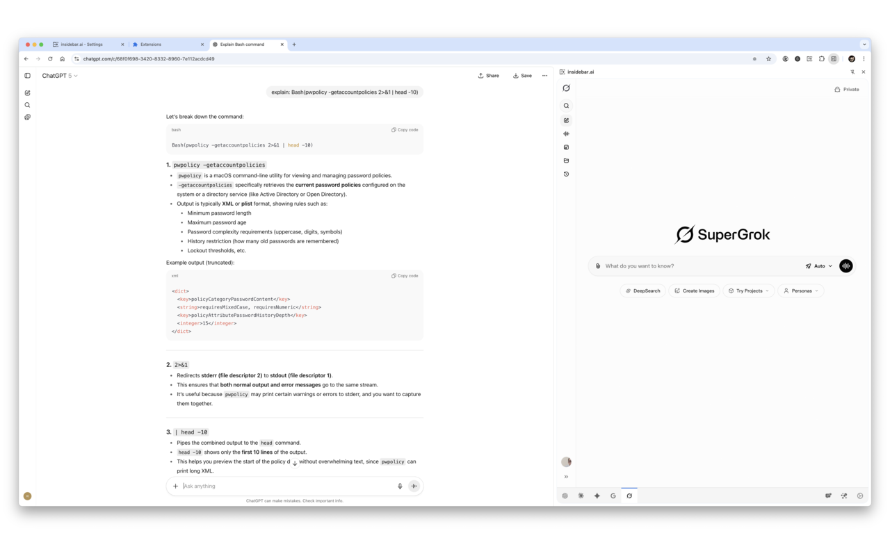
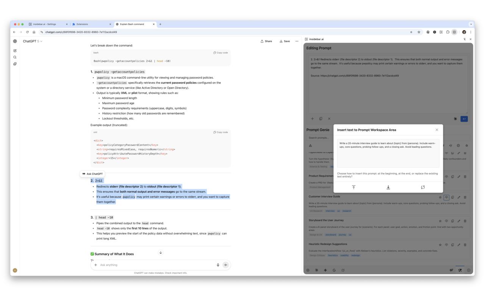
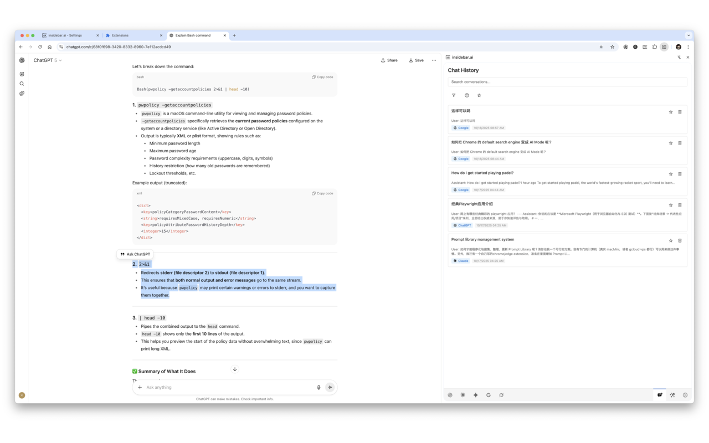
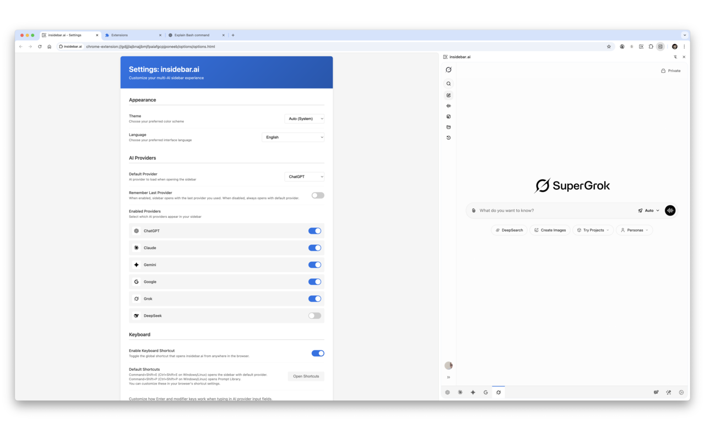
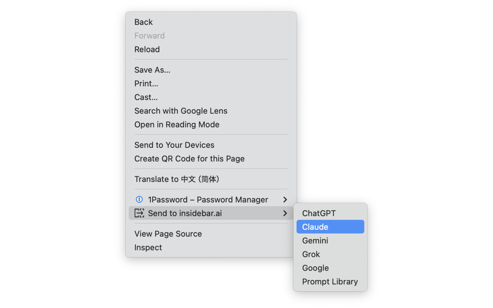
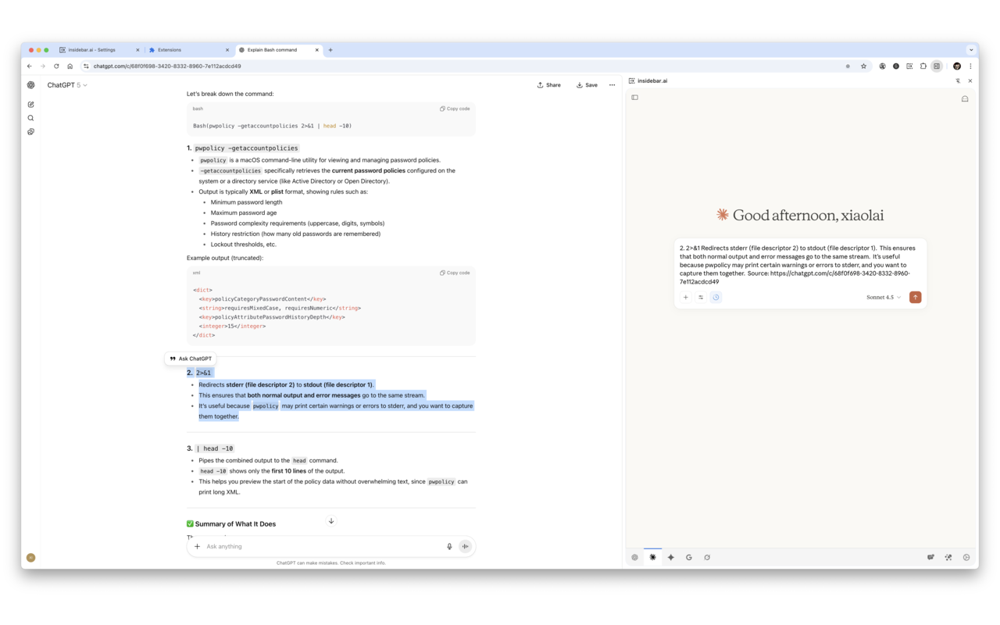
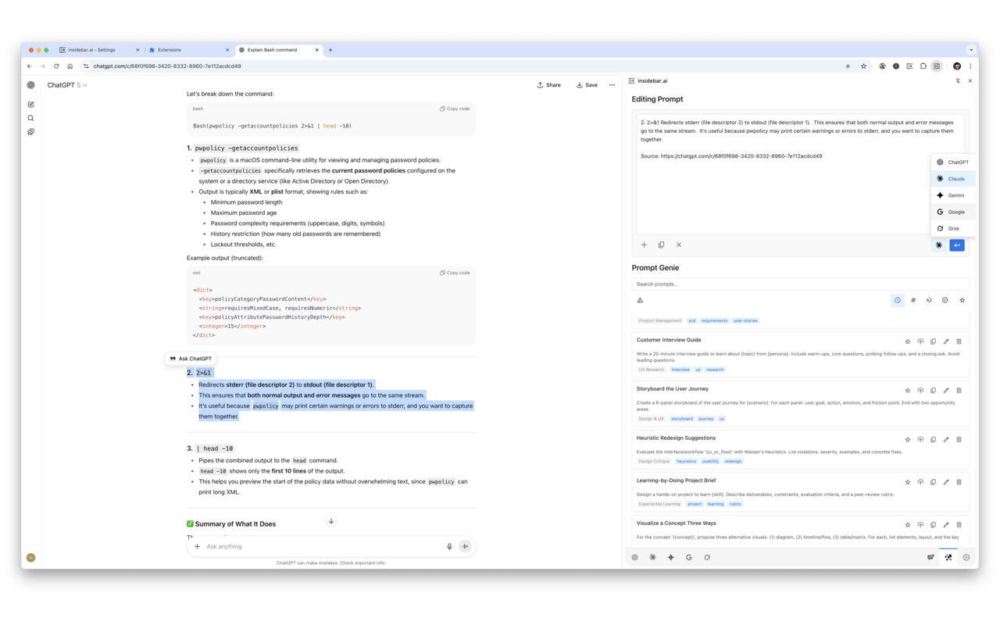

# insidebar.ai

> Your AI command center: ChatGPT, Claude, Gemini, Google AI, Grok, and DeepSeek—all in one sidebar

**Quick access to multiple AI assistants without switching tabs.** Open the sidebar, choose your AI, and start chatting. All your AI conversations in one place, with your existing logins.

---

## Quick Navigation

- [Features](#features)
- [Installation](#installation)
  - [Chrome Web Store (Recommended)](#chrome-web-store-recommended)
  - [Manual Installation (Advanced)](#manual-installation-advanced)
- [Supported AI Providers](#supported-ai-providers)
- [How to Use](#how-to-use)
- [Screenshots](#screenshots)
- [Privacy & Security](#privacy--security)
- [Troubleshooting](#troubleshooting)
- [Support & Contributing](#support--contributing)

---

## Features

### 🤖 6 AI Providers in One Sidebar

ChatGPT, Claude, Gemini, Google AI Mode, Grok, and DeepSeek — all accessible with one click. No more juggling tabs.

Switch between providers using the tabs at the bottom of the sidebar. Each session persists, so you can return to any conversation right where you left off.

### 📚 Prompt Library

Save, organize, and reuse your best prompts across any AI provider.

- **50+ Curated Prompts**: Import a starter library covering coding, writing, analysis, and more
- **Categories & Tags**: Organize prompts for easy discovery
- **Variables Support**: Create dynamic templates with placeholders
- **Search & Filter**: Find prompts instantly by keyword or favorite status
- **Import/Export**: Share prompt libraries or back up your collection

### 💬 Chat History

Save important conversations from any AI provider. Never lose a valuable discussion.

- **Universal Saving**: Works with ChatGPT, Claude, Gemini, Grok, and DeepSeek
- **Full Markdown Rendering**: Conversations display beautifully with code highlighting
- **Search & Filter**: Find conversations by provider or content
- **Original Links**: Access the original conversation URL anytime

### ⌨️ Powerful Keyboard Shortcuts

- **`Cmd/Ctrl+Shift+E`**: Open sidebar instantly
- **`Cmd/Ctrl+Shift+P`**: Access prompt library
- **Customizable Enter Behavior**: Configure Enter vs Shift+Enter for each AI provider
  - Choose from presets: Default, Swapped, Slack-style, Discord-style, or create your own

### 🎨 Your Preferences, Your Way

**Source URL Control** (New in v1.6.0)
Choose where URLs appear when sending selected text or page content:
- At the end (after content)
- At the beginning (before content)
- Don't include URL (save tokens)

**Theme Customization**
Auto-detect system theme or set Light/Dark mode manually

**Language Support**
Available in 10 languages: English, Chinese (Simplified & Traditional), Japanese, Korean, Spanish, French, German, Italian, and Russian

**Provider Management**
Enable only the AI providers you use. Set your default provider.

### 🔒 Privacy First

- **No API keys required**—uses your existing browser logins
- **All data stays local** in your browser's storage
- **Zero tracking, zero analytics**—we don't collect anything
- **Fully open source**—review the code before installing

---

## Installation

Choose your installation method:

### Chrome Web Store (Recommended)

**One-click installation. Automatic updates. No developer mode needed.**

1. Visit the [Chrome Web Store page](https://chromewebstore.google.com/detail/insidebarai/jhlfjcmiemebjjnbdoddhoohbdjnfece)
2. Click **"Add to Chrome"**
3. Click **"Add Extension"** in the popup
4. Done! Click the extension icon or press `Cmd/Ctrl+Shift+E`

**Also works on Microsoft Edge:** Install from Chrome Web Store using Edge browser.

---

### Manual Installation (Advanced)

**For developers or users who prefer manual control.**

Perfect if you want to:
- Review the source code before installing
- Install a development or unreleased version
- Avoid automatic updates
- Have full control over when to update

<b>Click to expand: Manual installation instructions</b>

#### Chrome Installation

1. **Download** the latest release from [GitHub Releases](https://github.com/xiaolai/insidebar-ai/releases) or click **Code → Download ZIP** on the main repository page
2. **Extract** the ZIP file to a permanent location (don't delete this folder after installation)
3. **Open Chrome** and navigate to `chrome://extensions/`
4. **Enable** "Developer mode" using the toggle in the top right corner
5. **Click** "Load unpacked" button
6. **Select** the extracted folder containing `manifest.json`
7. **Done!** The extension icon appears in your toolbar

#### Microsoft Edge Installation

1. **Download and extract** the ZIP file (same as Chrome step 1-2)
2. **Open Edge** and navigate to `edge://extensions/`
3. **Enable** "Developer mode" in the left sidebar
4. **Click** "Load unpacked" button
5. **Select** the extracted folder
6. **Done!**

#### Common Questions

**Q: Why does it say "Developer mode extensions"?**
This is normal for manually installed extensions. It doesn't mean the extension is unsafe—just that it wasn't installed from the store.

**Q: Will this work permanently?**
Yes! Once installed, it stays installed. Chrome/Edge may show a warning banner about developer mode extensions—you can dismiss it.

**Q: How do I update manually installed extensions?**
Download the latest version from GitHub, remove the old extension from `chrome://extensions/`, and install the new version following the same steps. Your settings and prompts are stored separately and won't be deleted.

---

## Supported AI Providers

| Provider | Type | Website |
|----------|------|---------|
| **ChatGPT** | Full Sidebar | https://chat.openai.com |
| **Claude** | Full Sidebar | https://claude.ai |
| **Gemini** | Full Sidebar | https://gemini.google.com |
| **Google AI** | Search Enhancement | https://google.com (AI Mode) |
| **Grok** | Full Sidebar | https://grok.com |
| **DeepSeek** | Full Sidebar | https://chat.deepseek.com |

**No API keys required.** Just log into the providers you want to use in your browser, and insidebar.ai will use those existing sessions.

---

## How to Use

### First-Time Setup

1. **Log into your AI providers**
   Visit the websites of the AI providers you want to use (ChatGPT, Claude, etc.) and log in normally. The extension will use these existing sessions.

2. **Open the sidebar**
   Click the extension icon in your toolbar, or press `Cmd+Shift+E` (Mac) / `Ctrl+Shift+E` (Windows/Linux).

3. **Start chatting**
   Select an AI provider from the tabs at the bottom of the sidebar. The AI interface loads directly—same as using it in a regular tab.

4. **Customize (optional)**
   Click the gear icon to access Settings and configure keyboard shortcuts, theme, enabled providers, and more.

### Opening the Sidebar

**Keyboard shortcut:** `Cmd/Ctrl+Shift+E`
**Extension icon:** Click the icon in your browser toolbar
**Right-click menu:** Right-click on any webpage → "Send to insidebar.ai" → choose a provider

### Switching AI Providers

The bottom of the sidebar shows tabs for each enabled provider. Click a tab to switch to that AI. Your sessions persist—switching back returns you to where you left off.

### Using the Prompt Library

Press `Cmd/Ctrl+Shift+P` to open the Prompt Library, or click the notebook icon at the bottom of the sidebar.

**Create a prompt:**
Click "New Prompt", enter a title, content, and optional category/tags. Click Save.

**Use a prompt:**
Click any prompt card to copy it to your clipboard, then paste it into the AI chat input.

**Insert into workspace:**
Click the circular arrow icon on a prompt to insert it into the editing workspace. From there, you can:
- Compose multi-part prompts
- Edit before sending
- Send to any AI provider with one click

**Organize prompts:**
Use categories (Coding, Writing, Analysis, or create your own custom categories). Add tags for easy searching. Mark favorites using the star icon for quick access.

**Import default prompts:**
Open Settings and click "Import Default Prompts" to load a starter collection of 50+ curated prompts covering coding, writing, analysis, and general use.

**Import custom prompts:**
Click "Import Custom Prompts" to load your own prompt libraries. Files must be in JSON format. The extension validates the format and shows helpful error messages if the structure is incorrect.

### Saving Chat History

While viewing a conversation in any supported AI provider (ChatGPT, Claude, Gemini, Grok, DeepSeek), click the save button that appears at the top of the chat interface.

The conversation is saved locally with:
- Full message content with markdown rendering
- Original conversation URL
- Provider and timestamp

Access saved conversations anytime by clicking the history icon in the sidebar.

### Sending Selected Text to AI

1. **Select text** on any webpage
2. **Right-click** and choose "Send to insidebar.ai"
3. **Choose a provider** (ChatGPT, Claude, etc.)
4. The sidebar opens with your selected text ready to send

You can configure whether the source URL appears at the beginning, end, or not at all in Settings → Content Sending.

### Customizing Keyboard Shortcuts

**Chrome:** Navigate to `chrome://extensions/shortcuts`
**Edge:** Navigate to `edge://extensions/shortcuts`

Find "insidebar.ai" in the list and click the pencil icon to customize:
- Open sidebar shortcut
- Open Prompt Library shortcut

**Note:** Some key combinations may conflict with other extensions or browser shortcuts. Choose combinations that don't conflict.

### Settings Overview

Click the gear icon at the bottom of the sidebar to access Settings.

**Appearance**
Choose Auto (follows system), Light, or Dark theme

**AI Providers**
Enable or disable specific providers. Only enabled providers appear in the sidebar tabs. Set your default provider (loads when you first open the sidebar).

**Keyboard**
- Toggle keyboard shortcuts on/off
- Customize Enter key behavior for each AI provider
  - Presets: Default, Swapped, Slack-style, Discord-style
  - Custom: Define your own key combinations for sending vs new line

**Chat History**
View statistics about saved conversations. Export or clear history.

**Prompt Library**
- Import default prompt library (50+ curated prompts)
- Import custom prompt libraries (JSON format)
- View prompt count and storage usage

**Content Sending** (New in v1.6.0)
Choose where source URLs appear when sending selected text or page content:
- At end (after content)
- At beginning (before content)
- Don't include URL

**Data Management**
- View storage usage for prompts and chat history
- Export all data as backup (JSON format)
- Import previously exported data
- Reset all data if needed

---

## Screenshots

<table>
  <tr>
    <td width="50%">
      
      
<em>Right-click to send selected text to any AI</em>

    </td>
    <td width="50%">
      
      
<em>Customize keyboard shortcuts, enter behavior, and more</em>

    </td>
  </tr>
  <tr>
    <td width="50%">
      
      
<em>Compose prompts and send to any provider</em>

    </td>
    <td width="50%">
      
      
<em>Save and organize conversations from any AI</em>

    </td>
  </tr>
</table>

---

## Privacy & Security

📄 **[Read our full Privacy Policy](PRIVACY.md)**

**Your data stays local.** All prompts, settings, and saved conversations are stored in your browser's local storage. Nothing is sent to external servers.

**No API keys required.** The extension uses your existing browser login sessions. It loads the real AI websites in the sidebar using your cookies—just like opening them in a new tab.

**No tracking.** The extension doesn't collect analytics, usage data, or any personal information. Zero telemetry.

**How it works technically:** The extension uses Chrome's `declarativeNetRequest` API to bypass X-Frame-Options headers, allowing AI provider websites to load in the sidebar iframe. This is the same security mechanism that extensions like password managers use. All code is open source and available for review.

**Cookie-based authentication:** When you log into an AI provider (like ChatGPT) in your browser, the extension can access those same login sessions to load the provider in the sidebar. Your credentials never pass through the extension—authentication is handled entirely by the AI provider's website.

---

## Troubleshooting

### Extension Issues

**The extension won't load**
Make sure you're using a recent version of Chrome (114+) or Edge (114+). Older versions don't support the required APIs.

**Extension icon doesn't appear in toolbar**
Click the puzzle piece icon in Chrome/Edge toolbar and pin "insidebar.ai" to make it always visible.

### AI Provider Issues

**An AI provider won't load in the sidebar**
1. First, visit that provider's website in a regular browser tab and log in
2. The extension needs an active login session to work
3. If still not working, try clearing your browser cache and cookies for that specific provider
4. Some providers may have regional restrictions or require specific account types

**Provider loads but shows login page**
Your session may have expired. Open the provider in a regular tab, log in again, then refresh the sidebar.

### Feature Issues

**Keyboard shortcuts don't work**
1. Check if another extension is using the same shortcut
2. Go to `chrome://extensions/shortcuts` (or `edge://extensions/shortcuts`)
3. View all shortcuts and change insidebar.ai shortcuts if needed
4. Some shortcuts may conflict with browser or OS hotkeys—try different combinations

**Dark mode isn't working**
1. Open Settings (gear icon)
2. Check the Theme dropdown
3. If set to "Auto", it follows your system theme
4. Change to "Dark" to force dark mode regardless of system setting

**Prompt Library keyboard shortcut opens but stays blank**
1. Check browser console for errors (F12 → Console tab)
2. Try refreshing the sidebar
3. If using manual installation, ensure you're using the latest version

**Chat History save button doesn't appear**
1. Make sure you're viewing an actual conversation (not the AI's home screen)
2. The save button appears at the top of the chat interface
3. Currently supported: ChatGPT, Claude, Gemini, Grok, DeepSeek

**Update checking shows old version**
- **Chrome Web Store installation**: Update checking is disabled (the store handles updates automatically)
- **Manual installation**: Click "Check for Updates" in Settings to see if a newer version is available on GitHub

### Settings & Data

**Settings aren't saving**
Check if you have sufficient storage quota in your browser. Go to Settings → Data Management to view storage usage.

**Lost all my prompts/settings**
If you cleared browser data or reinstalled the browser, local storage may have been wiped. This is why we recommend periodically exporting your data (Settings → Data Management → Export).

**Import fails with "Invalid JSON format"**
Ensure the file is valid JSON. Use a JSON validator if needed. For custom prompt libraries, check the structure matches the expected format (see `data/prompt-libraries/Generate_a_Basic_Prompt_Library.md`).

---

## Support & Contributing

### Found a Bug or Have a Feature Idea?

- **Open an issue**: [GitHub Issues](https://github.com/xiaolai/insidebar-ai/issues)
- **View changelog**: [CHANGELOG.md](CHANGELOG.md)
- **Star this repo**: If you find insidebar.ai useful, [give it a star](https://github.com/xiaolai/insidebar-ai)!

### Contributing

Contributions are welcome! Whether it's:
- Reporting bugs
- Suggesting features
- Improving documentation
- Translating to new languages
- Submitting pull requests

Please check existing issues before opening a new one.

---

## License

MIT License - see the [LICENSE](LICENSE) file for details.

---

**Built by [Xiaolai](https://github.com/xiaolai)** • Available in 10 languages • Open source & privacy-focused

---

# insidebar.ai - AI 命令中心

> 你的 AI 命令中心：ChatGPT、Claude、Gemini、Google AI、Grok 和 DeepSeek——全部在一个侧边栏中

**无需切换标签即可快速访问多个 AI 助手。** 打开侧边栏，选择你的 AI，开始聊天。所有 AI 对话都在一个地方，使用你现有的登录。

## 快速导航

- [功能特点](#功能特点)
- [安装方法](#安装方法)
  - [Chrome 商店（推荐）](#chrome-商店推荐)
  - [手动安装（高级）](#手动安装高级)
- [支持的 AI 提供商](#支持的-ai-提供商)
- [使用方法](#使用方法)
- [截图](#截图)
- [隐私与安全](#隐私--安全)
- [故障排除](#故障排除)
- [支持与贡献](#支持--贡献)

---

## 功能特点

### 🤖 一个侧边栏包含 6 个 AI 提供商

ChatGPT、Claude、Gemini、Google AI 模式、Grok 和 DeepSeek — 全部一键访问。不再需要来回切换标签。

使用侧边栏底部的标签在提供商之间切换。每个会话都会保持，因此您可以随时回到任何对话的离开位置。

### 📚 提示词库

保存、整理并跨任何 AI 提供商重用您的最佳提示词。

- **50+ 精选提示词**：导入包含编程、写作、分析等内容的入门库
- **分类与标签**：组织提示词以便于发现
- **变量支持**：使用占位符创建动态模板
- **搜索与过滤**：按关键词或收藏状态即时查找提示词
- **导入/导出**：分享提示词库或备份您的收藏

### 💬 聊天历史记录

保存来自任何 AI 提供商的重要对话。永不丢失有价值的讨论。

- **通用保存**：适用于 ChatGPT、Claude、Gemini、Grok 和 DeepSeek
- **完整 Markdown 渲染**：对话显示精美，带有代码高亮
- **搜索与过滤**：按提供商或内容查找对话
- **原始链接**：随时访问原始对话 URL

### ⌨️ 强大的键盘快捷键

- **`Cmd/Ctrl+Shift+E`**：立即打开侧边栏
- **`Cmd/Ctrl+Shift+P`**：访问提示词库
- **可自定义的 Enter 行为**：为每个 AI 提供商配置 Enter vs Shift+Enter
  - 从预设中选择：默认、交换、Slack 风格、Discord 风格，或创建您自己的

### 🎨 您的偏好，您的方式

**源 URL 控制**（v1.6.0 新增）
发送选定的文本或页面内容时选择 URL 出现的位置：
- 在末尾（内容之后）
- 在开头（内容之前）
- 不包含 URL（节省 tokens）

**主题自定义**
自动检测系统主题或手动设置亮色/暗色模式

**语言支持**
提供 10 种语言：英语、中文（简体/繁体）、日语、韩语、西班牙语、法语、德语、意大利语和俄语

**提供商管理**
仅启用您使用的 AI 提供商。设置您的默认提供商。

### 🔒 隐私优先

- **无需 API 密钥**——使用您现有的浏览器登录
- **所有数据本地存储**在浏览器的存储中
- **零跟踪、零分析**——我们不收集任何信息
- **完全开源**——安装前可以审查代码

---

## 安装方法

选择您的安装方法：

### Chrome 商店（推荐）

**一键安装。自动更新。无需开发者模式。**

1. 访问 [Chrome 商店页面](https://chromewebstore.google.com/detail/insidebarai/jhlfjcmiemebjjnbdoddhoohbdjnfece)
2. 点击 **"添加到 Chrome"**
3. 在弹窗中点击 **"添加扩展程序"**
4. 完成！点击扩展图标或按 `Cmd/Ctrl+Shift+E`

**也适用于 Microsoft Edge**：使用 Edge 浏览器从 Chrome 商店安装。

---

### 手动安装（高级）

**适用于开发者或喜欢手动控制的用户。**

如果您想要：
- 安装前审查源代码
- 安装开发版或未发布的版本
- 避免自动更新
- 完全控制更新时间

<b>点击展开：手动安装说明</b>

#### Chrome 安装

1. **下载** [GitHub Releases](https://github.com/xiaolai/insidebar-ai/releases) 的最新版本，或在主仓库页面点击 **Code → Download ZIP**
2. **解压** ZIP 文件到永久位置（安装后不要删除此文件夹）
3. **打开 Chrome** 并导航到 `chrome://extensions/`
4. **启用** 右上角的"开发者模式"开关
5. **点击**"加载已解压的扩展程序"按钮
6. **选择** 包含 `manifest.json` 的解压文件夹
7. **完成！** 扩展图标出现在您的工具栏中

#### Microsoft Edge 安装

1. **下载并解压** ZIP 文件（与 Chrome 步骤 1-2 相同）
2. **打开 Edge** 并导航到 `edge://extensions/`
3. **启用** 左侧边栏的"开发者模式"
4. **点击**"加载已解压的扩展程序"按钮
5. **选择** 解压的文件夹
6. **完成！**

#### 常见问题

**问：为什么显示"开发者模式扩展"？**
这是手动安装的扩展的正常现象。这不意味着扩展不安全——只是它不是从商店安装的。

**问：这个会永久工作吗？**
是的！一旦安装，就会一直保持安装状态。Chrome/Edge 可能会显示关于开发者模式扩展的警告横幅——您可以忽略它。

**问：如何手动更新扩展？**
从 GitHub 下载最新版本，从 `chrome://extensions/` 删除旧扩展，并按照相同步骤安装新版本。您的设置和提示词是单独存储的，不会被删除。

---

## 支持的 AI 提供商

| 提供商 | 类型 | 网站 |
|----------|------|---------|
| **ChatGPT** | 完整侧边栏 | https://chat.openai.com |
| **Claude** | 完整侧边栏 | https://claude.ai |
| **Gemini** | 完整侧边栏 | https://gemini.google.com |
| **Google AI** | 搜索增强 | https://google.com（AI 模式） |
| **Grok** | 完整侧边栏 | https://grok.com |
| **DeepSeek** | 完整侧边栏 | https://chat.deepseek.com |

**无需 API 密钥。** 只需在浏览器中登录您要使用的提供商，insidebar.ai 将使用这些现有会话。

---

## 使用方法

### 首次设置

1. **登录 AI 提供商**
   访问您要使用的 AI 提供商网站（ChatGPT、Claude 等）并正常登录。扩展将使用这些现有会话。

2. **打开侧边栏**
   点击浏览器工具栏中的扩展图标，或按 `Cmd+Shift+E`（Mac）/`Ctrl+Shift+E`（Windows/Linux）。

3. **开始聊天**
   从侧边栏底部的标签中选择一个 AI 提供商。AI 界面直接加载——与在常规标签中使用相同。

4. **自定义（可选）**
   点击齿轮图标访问设置，配置键盘快捷键、主题、启用的提供商等。

### 打开侧边栏

**键盘快捷键：** `Cmd/Ctrl+Shift+E`
**扩展图标：** 点击浏览器工具栏中的图标
**右键菜单：** 在任何网页上右键 →"发送到 insidebar.ai" → 选择提供商

### 切换 AI 提供商

侧边栏底部显示了每个启用提供商的标签。点击标签切换到该 AI。您的会话会保持——切换回来时会回到您离开的位置。

### 使用提示词库

按 `Cmd/Ctrl+Shift+P` 打开提示词库，或点击侧边栏底部的笔记本图标。

**创建提示词：**
点击"新建提示词"，输入标题、内容和可选的分类/标签，然后点击保存。

**使用提示词：**
点击任何提示词卡片将其复制到剪贴板，然后粘贴到 AI 聊天输入框中。

**插入到工作区：**
点击提示词上的圆形箭头图标将其插入到编辑工作区。在那里，您可以：
- 编写多部分提示词
- 发送前编辑
- 一键发送到任何 AI 提供商

**组织提示词：**
使用分类（编程、写作、分析，或创建您自己的自定义分类）。添加标签以便于搜索。使用星形图标标记收藏，以便快速访问。

**导入默认提示词：**
打开设置并点击"导入默认提示词"来加载包含编程、写作、分析和通用用途的 50+ 个精选提示词的入门集合。

**导入自定义提示词：**
点击"导入自定义提示词"来加载您自己的提示词库。文件必须是 JSON 格式。如果结构不正确，扩展会验证格式并显示有用的错误消息。

### 保存聊天历史

在任何支持的 AI 提供商（ChatGPT、Claude、Gemini、Grok、DeepSeek）中查看对话时，点击聊天界面顶部出现的保存按钮。

对话将本地保存，包含：
- 带有 Markdown 渲染的完整消息内容
- 原始对话 URL
- 提供商和时间戳

随时通过点击侧边栏中的历史图标访问保存的对话。

### 发送选定的文本给 AI

1. **在网页上选择文本**
2. **右键点击**并选择"发送到 insidebar.ai"
3. **选择一个提供商**（ChatGPT、Claude 等）
4. 侧边栏打开，选定的文本准备发送

您可以在设置 → 内容发送中配置源 URL 是出现在开头、末尾还是完全不出现。

### 自定义键盘快捷键

**Chrome：** 导航到 `chrome://extensions/shortcuts`
**Edge：** 导航到 `edge://extensions/shortcuts`

在列表中找到"insidebar.ai"并点击铅笔图标来自定义：
- 打开侧边栏快捷键
- 打开提示词库快捷键

**注意：** 某些按键组合可能与其他扩展或浏览器快捷键冲突。选择不冲突的组合。

### 设置概览

点击侧边栏底部的齿轮图标访问设置。

**外观**
选择自动（跟随系统）、亮色或暗色主题

**AI 提供商**
启用或禁用特定提供商。只有启用的提供商才会显示在侧边栏标签中。设置您的默认提供商（首次打开侧边栏时加载）。

**键盘**
- 开关键盘快捷键
- 为每个 AI 提供商自定义 Enter 键行为
  - 预设：默认、交换、Slack 风格、Discord 风格
  - 自定义：为您自己的发送 vs 换行键组合定义

**聊天历史**
查看有关保存对话的统计信息。导出或清除历史记录。

**提示词库**
- 导入默认提示词库（50+ 个精选提示词）
- 导入自定义提示词库（JSON 格式）
- 查看提示词数量和存储使用情况

**内容发送**（v1.6.0 新增）
选择发送选定文本或页面内容时源 URL 出现的位置：
- 在末尾（内容之后）
- 在开头（内容之前）
- 不包含 URL

**数据管理**
- 查看提示词和聊天历史的存储使用情况
- 导出所有数据作为备份（JSON 格式）
- 导入之前导出的数据
- 如需要重置所有数据

---

## 截图

<table>
  <tr>
    <td width="50%">
      
      
<em>右键发送选定的文本给任何 AI</em>

    </td>
    <td width="50%">
      
      
<em>自定义键盘快捷键、Enter 行为等</em>

    </td>
  </tr>
  <tr>
    <td width="50%">
      
      
<em>编写提示词并发送给任何提供商</em>

    </td>
    <td width="50%">
      
      
<em>保存和整理来自任何 AI 的对话</em>

    </td>
  </tr>
</table>

---

## 隐私与安全

📄 **[阅读我们的完整隐私政策](PRIVACY.md)**

**您的数据保持本地。** 所有提示词、设置和保存的对话都存储在您浏览器的本地存储中。没有任何内容发送到外部服务器。

**无需 API 密钥。** 扩展使用您现有的浏览器登录会话。它使用您的 cookie 在侧边栏中加载真实的 AI 网站——就像在新标签页中打开它们一样。

**无跟踪。** 扩展不收集分析数据、使用数据或任何个人信息。零遥测。

**技术工作原理：** 扩展使用 Chrome 的 `declarativeNetRequest` API 绕过 X-Frame-Options 头部，允许 AI 提供商网站在侧边栏 iframe 中加载。这是与密码管理器等扩展相同的安全机制。所有代码都是开源的，可供审查。

**基于 Cookie 的认证：** 当您在浏览器中登录 AI 提供商（如 ChatGPT）时，扩展可以访问相同的登录会话以在侧边栏中加载该提供商。您的凭据从不经过扩展——认证完全由 AI 提供商的网站处理。

---

## 故障排除

### 扩展问题

**扩展无法加载**
请确保您使用的是最新版本的 Chrome（114+）或 Edge（114+）。旧版本不支持所需的 API。

**扩展图标不出现在工具栏**
点击 Chrome/Edge 工具栏中的拼图图标并将"insidebar.ai"固定使其始终可见。

### AI 提供商问题

**AI 提供商无法在侧边栏中加载**
1. 首先，在常规浏览器标签中访问该提供商网站并登录
2. 扩展需要一个活动的登录会话才能工作
3. 如果仍然无法工作，尝试清除该特定提供商的浏览器缓存和 cookie
4. 某些提供商可能有区域限制或需要特定的账户类型

**提供商加载但显示登录页面**
您的会话可能已过期。在常规标签中打开提供商，重新登录，然后刷新侧边栏。

### 功能问题

**键盘快捷键不工作**
1. 检查是否有其他扩展使用相同的快捷键
2. 转到 `chrome://extensions/shortcuts`（或 `edge://extensions/shortcuts`）
3. 查看所有快捷键，如果需要更改 insidebar.ai 的快捷键
4. 某些快捷键可能与浏览器或 OS 热键冲突——尝试不同的组合

**暗色模式不工作**
1. 打开设置（齿轮图标）
2. 检查主题下拉菜单
3. 如果设置为"自动"，它会跟随您的系统主题
4. 更改为"暗色"以强制使用暗色模式，无论系统设置如何

**提示词库键盘快捷键打开但保持空白**
1. 检查浏览器控制台是否有错误（F12 → 控制台标签）
2. 尝试刷新侧边栏
3. 如果使用手动安装，请确保您使用的是最新版本

**聊天历史保存按钮不出现**
1. 确保您正在查看实际的对话（不是 AI 的主页）
2. 保存按钮出现在聊天界面顶部
3. 当前支持：ChatGPT、Claude、Gemini、Grok、DeepSeek

**更新检查显示旧版本**
- **Chrome 商店安装**：已禁用更新检查（商店自动处理更新）
- **手动安装**：在设置中点击"检查更新"以查看 GitHub 上是否有新版本可用

### 设置与数据

**设置未保存**
检查您的浏览器是否有足够的存储配额。转到设置 → 数据管理查看存储使用情况。

**丢失了我的所有提示词/设置**
如果您清除了浏览器数据或重新安装了浏览器，本地存储可能已被清除。这就是为什么我们建议定期导出数据（设置 → 数据管理 → 导出）。

**导入失败，显示"无效的 JSON 格式"**
确保文件是有效的 JSON。如果需要，使用 JSON 验证器。对于自定义提示词库，检查结构是否符合预期格式（参见 `data/prompt-libraries/Generate_a_Basic_Prompt_Library.md`）。

---

## 支持与贡献

### 发现错误或有功能想法？

- **打开问题**：[GitHub Issues](https://github.com/xiaolai/insidebar-ai/issues)
- **查看更新日志**：[CHANGELOG.md](CHANGELOG.md)
- **给这个仓库点星**：如果您发现 insidebar.ai 有用，[给它点个星](https://github.com/xiaolai/insidebar-ai)！

### 贡献

欢迎贡献！无论是：
- 报告错误
- 建议功能
- 改进文档
- 翻译到新语言
- 提交拉取请求

在打开新问题前，请检查现有问题。

---

## 许可证

MIT 许可证 - 详情请查看 [LICENSE](LICENSE) 文件。

---

**由 [Xiaolai](https://github.com/xiaolai)** • 支持 10 种语言 • 开源且注重隐私
